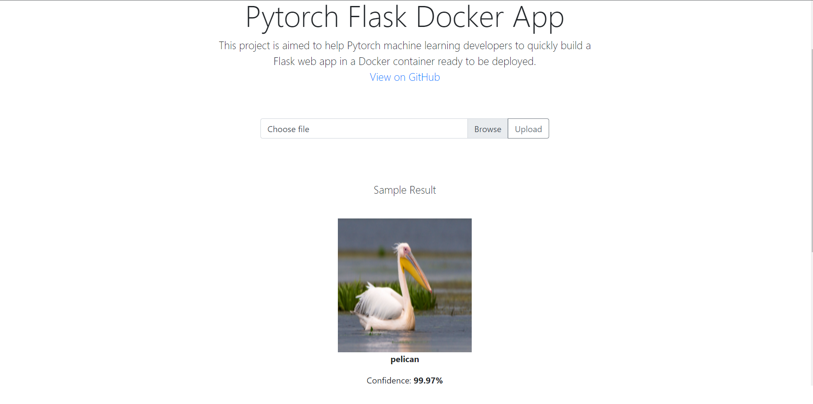

# Flask/Pytorch/Docker starter app

This app is created using `Flask` and `Pytorch`, containerized using `Docker` and provisioned on `Heroku`



This website is deployed in Heroku: http://mobilenet-classifier-rubiks.herokuapp.com/

By default, this app uses MobileNetV3 image classifier that was pre-trained on the ImageNet dataset.

## Getting Started (using Docker)

1. Create a Docker image
    ```
    docker build -t mobilenet-classifier-rubiks .
    ```
    This will create an image with the name `mobilenet-classifier-rubiks`.

2. Run the docker image
    ```
    docker run -d -p 127.0.0.1:5000:80 mobilenet-classifier-rubiks
    ```
    This will run the app on port `5000`. You can replace that with which ever port that is more suitable.

## Deploying to Heroku

- Log into `Heroku Container Registry`

    ```
    heroku container:login
    ```
- Create a `Heroku` app
    ```
    heroku create mobilenet-classifier-rubiks
    ```
- Push your docker image to the Container Registry. Depending
    on the size of the image, this can take a while.
    ```
    heroku container:push web -a mobilenet-classifier-rubiks
    ```
- Once the image has been pushed to the Container Registry, the app can be released using 

    ```
    heroku container:release web -a  mobilenet-classifier-rubiks

    ```
## Built With

* [Pytorch](https://pytorch.org/) - The Machine Learning framework used
* [Flask](http://flask.palletsprojects.com/en/1.1.x/) - The web server library

## License

The UI and basic structure of the app has been inspired by Imad Toubal's [project on GitHub](https://github.com/imadtoubal/Pytorch-Flask-Docker-App), 


This project is licensed under the MIT License - see the [LICENSE](LICENSE) file for details


 Happy coding!
